# Dashboard and Theme System – Master Plan

Single execution plan combining stabilization, audit fixes (duplicate actions, theme readability, layout, org chart, mojibake), and upgrades (action registry, contrast guard, theme stress-test, CSS debt, token linting, role-adaptive blocks, performance, pre-deploy gates).

---

## 1. Current state and what’s already done

### Screenshot / audit summary

- **Theme pack catalog (Site Settings):** Low-contrast descriptions on cards; mixed `--color-*` vs `--admin-content-*`. Partially addressed by `theme-visibility-guard.css` (untracked); needs commit and full coverage.
- **Header (portal/dark):** Possible mojibake (date pipe, “Ctrl+K”/English). Needs encoding pass.
- **Backend dashboard:** Dense grid; many “No data to display”; slight panel color variation; duplicate “Customize layout” in welcome block vs chips/primary CTAs.

### Already in branch (uncommitted)

| Area | Done | Where |
|------|------|--------|
| Theme visibility guard | New stylesheet + load points | `static/css/theme-visibility-guard.css`, base_site.html, base.html, portal_base.html |
| Theme pack catalog hardening | Guard rules for Site Settings + `[data-dashboard-page] .text-muted` | theme-visibility-guard.css |
| Backend dashboard v2 | Overview, welcome, chip row, action grid, side cards | backend_dashboard.html, apps/dashboard/context.py, backend-dashboard-v2.css |
| Multi-tenant verification | Checklist doc | docs/MULTI_TENANT_VERIFICATION_AND_IMPROVEMENTS.md |
| API Center | New app | apps/apicenter/ |

### Not yet done

Duplicate CTAs; single token contract and luminance fallback; layout compact flow; full dashboard sweep; teacher org diagram; mojibake pass; action registry; contrast guard; theme stress-test; CSS debt and token lint; role-adaptive blocks; performance; pre-deploy gates.

---

## 2. Master execution order (Phases 1–10)

### Phase 1: Stabilization + Guardrails

- Create clean working branch; snapshot UI (screenshot or list: `/admin/`, `/authentication/backend/`, teacher/parent dashboard URLs).
- Preflight: `git diff --check`; `python manage.py makemigrations --check --dry-run`; template compile / smoke URLs (`apps/accounts/tests/test_smoke_urls.py`).
- Lock no-regression targets: document in `docs/NO_REGRESSION_TARGETS.md` or tag tests.
- **Quick win:** Commit `static/css/theme-visibility-guard.css` and verify it loads on Site Settings and portal/base.

---

### Phase 2: Action strategy + governance

- **Dedupe (audit):** `backend_dashboard.html` includes `dashboard_customize_ui.html` (“Customize layout”, “Add widget”, “Reset to default”) in welcome controls; `context.py` provides primary_ctas (e.g. “School Settings”) and action_chips. Keep **one** “Customize layout” in welcome; show “Add widget” / “Reset to default” only in edit mode or a single overflow (⋮) menu. Apply same idea to admin/teacher/parent shells.
- **Action governance:** Introduce `dashboard_action_registry` (e.g. under `apps/dashboard/`) where each page defines primary / secondary / overflow actions once. Migrate backend dashboard to the registry first, then teacher/parent/admin so duplicate buttons cannot reappear.

---

### Phase 3: Theme system + tokens + contrast + CSS debt

- **Theme hardening:** Rely on committed `theme-visibility-guard.css`; standardize semantic tokens (surfaces / text / border / state) across `backend_dashboard.html` inline `:root`, `backend-dashboard-v2.css`, `admin-color-preview.css`, `design-tokens.css`. Normalize theme-pack catalog so labels/cards/toggles never go white-on-white. Add runtime luminance fallback for dynamic pack colors (flip text when background is too light/dark). Ensure lenses only override semantic tokens, not raw hex.
- **Contrast Auto-Guard:** Utility (JS or build-time) that, given a background, returns a text color with minimum contrast (e.g. WCAG 4.5:1) for cards, chips, badges, buttons; use in theme pack preview and dynamic UI.
- **CSS debt cleanup:** Move dashboard inline styles from `backend_dashboard.html` into scoped CSS (e.g. `backend-dashboard-v2.css` or a token file); remove duplicates; single token source for surfaces/text/borders/states.
- **Design token linting:** Lint/check that blocks raw hardcoded colors in dashboard (and optionally admin) templates except approved semantic tokens.

---

### Phase 4: Theme stress-test matrix

- Automate checks for key pages × (light / dark / system) × top theme packs × lenses; fail on contrast or white-on-white. Build on `scripts/dev/test_theme_visibility.py`. Integrate into CI or release script.

---

### Phase 5: Backend layout polish

- Keep Overview, welcome, admin-portal row unchanged. Rebuild everything **after** that row: compact flow, alignment; single source for calendar/time in right rail; Operations Watch + Quick Links as a clean right-rail stack (no duplication). Align charts/cards to a shared grid rhythm; remove dead/legacy blocks.

---

### Phase 6: Full dashboard sweep + role-adaptive blocks

- Audit every panel on `/admin`, `/backend`, teacher, parent for spacing, contrast, duplicate buttons, alignment. Remove empty gaps and redundant cards; keep density non-cramped. Normalize card/button states for light/dark/system and theme packs.
- **Role-adaptive blocks:** Show/hide widgets and quick links by role/permissions; use fallback “locked” or placeholder states instead of empty cards where appropriate.

---

### Phase 7: Teacher organization tree diagram

- **Current:** `templates/accounts/profile.html` shows org as text/list (org_chain, teacher_org_tree: Department, Position, Reports to). No diagram or photos.
- **Target:** Configurable, photo-based vertical org chart. Either extend `TeacherProfile.reports_to` or add a small `OrgChartNode` (or similar) model; auto-seed from `reports_to`, then allow manual edits. Replace profile list with top-to-bottom diagram (avatar, name, title). Support Cameroon labels (SMB/PTA/Principal/Censeur, etc.) via configurable node types.

---

### Phase 8: Mojibake + encoding cleanup

- Full pass on templates and views: fix artifacts (e.g. ·, —, arrows, punctuation). Priority: `templates/portal_base.html`, header/nav partials in `templates/components/` (date and language switcher). Ensure UTF-8; use `\u00b7` or literal · for middle dot where needed.

---

### Phase 9: QA + visibility certification

- Automated: existing checks plus new tests for action dedupe and org-chart context.
- Visual matrix: light/dark/system × representative theme packs × lenses on key pages; fix failing contrast and overflow before commit.
- **Pre-deploy safety gates:** Single gate (e.g. `scripts/pre_deploy_gate.sh` or extend `run_phase_checks.sh`): `python manage.py makemigrations --check`; template compile (e.g. smoke URL test); contrast/theme checks (Phase 4); smoke tests (`.github/workflows/smoke.yml`). CI blocks deploy on failure.

---

### Phase 10: Performance + CI gates

- **Performance:** Cache heavy KPI queries (60–120s); lazy-load lower-priority charts; skeleton loaders for dashboards.
- **CI:** Ensure migration check, template compile, contrast checks, and smoke tests are in CI (e.g. GitHub Actions) so broken deploys are blocked.

---

## 3. Rollback and safety

- Keep changes on a branch until Phase 9 passes; merge after QA.
- Visibility guard and token source can be reverted independently (single CSS + token file). No feature flags unless you want runtime toggles for org chart or role-adaptive blocks.

---

## 4. Definition of done

- No duplicated CTA in the same action block; actions driven from registry where applicable.
- No white-on-white / dark-on-dark in tested theme combinations; contrast guard in use for dynamic colors.
- Backend section after welcome/admin-portal matches compact reference flow.
- Teacher profile shows configurable, photo-based org diagram.
- Key pages covered by theme stress-test matrix; CI includes migration/template/contrast/smoke checks.
- All checks/tests pass before commit.

---

## 5. Flow diagram

```mermaid
flowchart LR
  P1[Phase 1 Stabilization]
  P2[Phase 2 Actions]
  P3[Phase 3 Theme and CSS]
  P4[Phase 4 Stress Matrix]
  P5[Phase 5 Layout]
  P6[Phase 6 Sweep]
  P7[Phase 7 Org Chart]
  P8[Phase 8 Mojibake]
  P9[Phase 9 QA and Gates]
  P10[Phase 10 Performance]
  P1 --> P2 --> P3 --> P4 --> P5 --> P6 --> P7 --> P8 --> P9 --> P10
```

---

## 6. Suggested starting point

Start with **Phase 1** (stabilization + commit visibility guard), then **Phase 2** (dedupe + registry) and **Phase 3** (theme + tokens + contrast + CSS debt). Take screenshot checkpoints before Phase 5 (layout polish).
