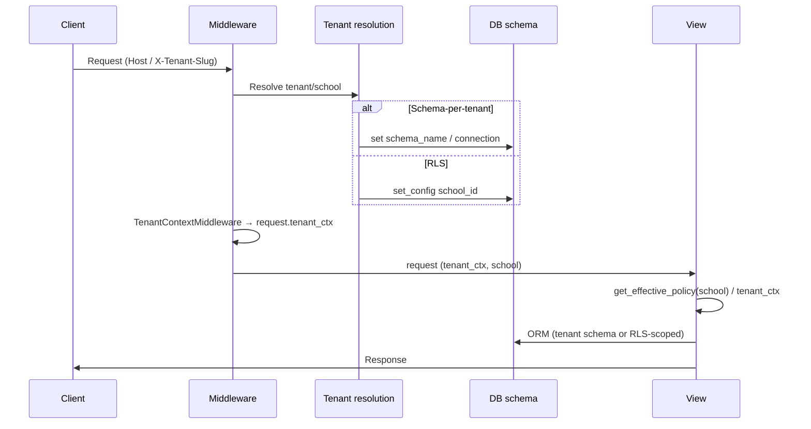
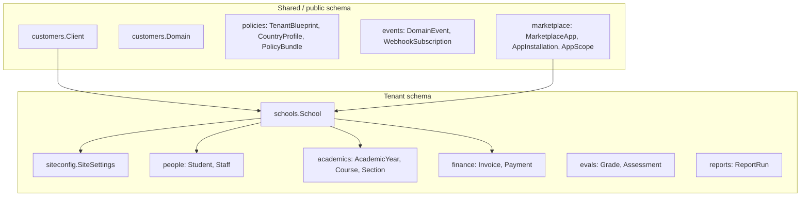

# RunMyCampus Architecture Map

**Source:** Blueprint C1. Single consolidated map: apps, models, tenant routing, shared vs tenant tables, and Mermaid diagrams.

See also: [docs/architecture/](architecture/) (tenancy.md, policy_injection.md, cache_keys.md, platform_north_star.md).

---

## 1) Django apps and purpose

| App | Purpose |
|-----|--------|
| **apps.accounts** | Auth, users, MFA, sessions, backend dashboard |
| **apps.customers** | Tenant registry (Client, Domain) — schema-per-tenant only |
| **apps.tenancy** | TenantContext, strategy, middleware, @tenant_task, system checks |
| **apps.policies** | Policy Registry: get_effective_policy, TenantBlueprint, CountryProfile, PolicyBundle |
| **apps.events** | DomainEvent outbox, emit_event, WebhookSubscription, WebhookDelivery |
| **apps.marketplace** | MarketplaceApp, AppInstallation, AppScope, ScopeGrant, install/uninstall, widget registry |
| **apps.schools** | School, host→school resolution, tenant URLs, superadmin, provisioning |
| **apps.siteconfig** | SiteSettings, WorkflowConfig, tenant config, DB router |
| **apps.portal** | Student/parent portal, KB, support, theme |
| **apps.academics** | Academic years, terms, courses, sections, attendance |
| **apps.people** | Students, staff, households, audit log |
| **apps.finance** | Invoices, payments, ledgers, compliance profile |
| **apps.evals** | Grades, assessments, certification |
| **apps.reports** | Report definitions, runs, exports |
| **apps.communication** | Messaging, announcements |
| **apps.analytics** | Dashboards, analytics, teacher compliance |
| **apps.compliance** | Access log, audit, consent, retention, export, erasure |
| **apps.observability** | Health, metrics, monitoring |
| **apps.api** | REST API, rate limiting, SCIM |
| **apps.apicenter** | API discovery, keys |
| **apps.requests** | Data/access requests |
| **apps.automation** | Automation rules |
| **apps.payroll** | Payroll cycles |
| **emis** | EMIS reporting |

---

## 2) Tenant routing entrypoints

- **RLS mode** (`USE_DJANGO_TENANTS=0`): `apps.schools.middleware.TenantMiddleware` → `request.school` from host; `RlsResetOnExceptionMiddleware` scopes `app.current_school_id`.
- **Schema-per-tenant** (`USE_DJANGO_TENANTS=1`): `django_tenants.middleware.main.TenantMainMiddleware` → `request.tenant` from host, schema switch; `TenantSchemaSchoolBridgeMiddleware` → `request.school`; `UrlConfSwitcherMiddleware` sets `request.urlconf` (tenant_urls vs public_urls).
- **Both:** `apps.tenancy.middleware.TenantContextMiddleware` builds `request.tenant_ctx` (TenantContext) after school/tenant resolution.
- **Host kind:** `apps.schools.middleware` / host_routing: `public_host_kind` → marketing, manager (`/super/`), or tenant (tenant_urls).

---

## 3) Shared vs tenant tables

| Location | Apps / tables |
|----------|----------------|
| **Shared (public schema in schema mode)** | django_tenants, customers (Client, Domain), tenancy, policies, events, marketplace, plus accounts, schools, siteconfig, compliance, observability, api, apicenter, portal, automation, requests, emis (see SHARED_APPS in config/settings.py). |
| **Tenant schema only (schema mode)** | academics, people, finance, evals, reports, communication, analytics, payroll (TENANT_APPS). |
| **RLS mode** | Single schema; RLS policies filter by school_id. |

---

## 4) Mermaid — Request flow and tenant resolution

---

## 5) Mermaid — DB schema (high-level)

---

## 6) Model dependencies (key only)

- **Control plane:** Client, Domain, TenantBlueprint, CountryProfile, PolicyBundle, MarketplaceApp, AppInstallation, AppScope, ScopeGrant, AppAuditLog, DomainEvent, WebhookSubscription.
- **Tenant data:** School, SiteSettings, User, Student, Staff, AcademicYear, Invoice, Payment, Grade, etc.
- **Cross-boundary:** Modules use `get_effective_policy(school)` and event `emit_event()`; they do not import control-plane ORM directly (enforced by test: `test_control_plane_boundary`).

Regenerate URL/app/migration lists: `bash scripts/regen_architecture_docs.sh`.
