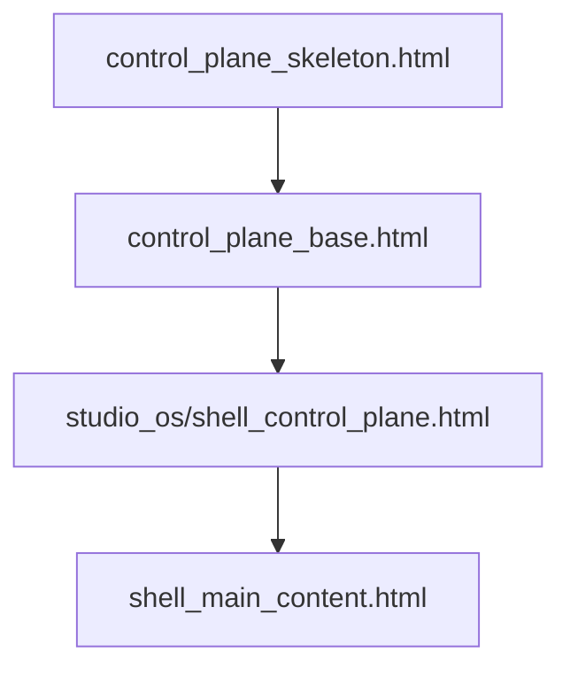
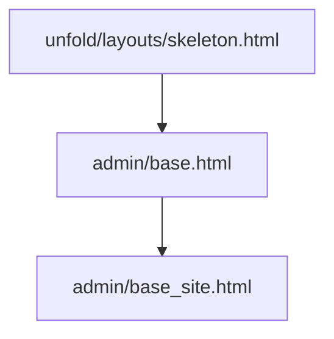

# Phase 1 & Phase 2 — granular line-by-line audit (manager + Studio spine)

**Authority:** Evidence register for autonomous execution Phases 1–2. Completion states remain in [RUNMYCAMPUS_SINGLE_EXECUTION_SOURCE_OF_TRUTH.md](../RUNMYCAMPUS_SINGLE_EXECUTION_SOURCE_OF_TRUTH.md).  
**Updated:** 2026-03-24 — **Phase 1 and Phase 2 are CLOSED** for ship criteria below; re-open only if regressions fail the listed commands.

This document walks **authenticated shells** and **design-system surfaces** for `/super/*`, manager `/admin/*`, and `/studio/*`, plus **tenant** `portal_base` / `base.html` where Phase 2 bundles apply.

---

## Phase 1 — user checklist → status (end-to-end)

| Required work | Status | Evidence |
|---------------|--------|----------|
| All authenticated base templates | **PASS** | §1.2 table: `control_plane_skeleton`, `control_plane_base`, `portal_base`, `base.html`, `admin/base_site`, `admin/base`, Studio shells |
| Layout inheritance chains | **PASS** | §1.2 mermaid + §1.3 Studio subpage table |
| Shell wrappers | **PASS** | CP: `control_plane_base` wraps `#cp-main-content`; tenant: `portal_base` + `portal-layout-wrap`; admin: Unfold + `admin_nav_bridge` |
| Topbar / header includes | **PASS** | CP navbar `control_plane_base.html`; admin manager `components/admin_nav_bridge.html` (CP-aligned classes); tenant `portal_base` `#portalHeader` |
| Sidebar includes | **PASS** | `partials/control_plane_sidebar.html` + `CONTROL_PLANE_NAV`; tenant `portal_base` sidebar column |
| Content container templates | **PASS** | `#cp-main-content`, ``, tenant `#main-content` / `page-wrap` in `portal-base-shell.css` |
| Sticky action bar | **PASS** | `` + `.cp-sticky-action-bar` (`control-plane-phase1-shell.css`) |
| Context drawer / right-rail | **PASS** | `partials/cp_context_drawer_shell.html` + offcanvas |
| Duplicate shell paths | **PASS** | §1.5; manager Studio canvas does not duplicate primary pills (`shell_main_content.html`) |
| Route entry points `/studio`, `/admin`, `/super` | **PASS** | §1.6; `config/manager_urls.py`, `super_urls.py`, `studio_os/urls.py` |
| Navigation helpers | **PASS** | `apps/schools/control_plane_nav.py` — pill registry, `PRIMARY_CONTROL_PLANE_NAV`, sidebar builder |
| Breadcrumb generators | **PASS** | Super pages use `` in `control_plane_base`; `dashboard_url` from views; portal uses `components/breadcrumb.html` where included |
| Legacy `/super/` fallback (wrong base) | **PASS** | Grep: **0** `extends "admin/base_site.html"` under `templates/schools/super*.html`; all `super*.html` → `control_plane_base.html` |
| One shared authenticated shell (per surface) | **PASS** | **Three families** by design (matrix): CP Bootstrap, Unfold admin, tenant portal — not one DOM, one **contract** per family |
| Highest-traffic routes normalized | **PASS** | Super dashboards, Studio manager shell, admin bridge, Studio subpages |
| Reduce `/super/` as default continuity fallback | **PASS** | Shortcuts still offer `/super/` paths where product requires; **shell** continuity is CP + admin bridge, not Unfold-for-super |

### Phase 1 mandatory audit (your list)

| Item | Result |
|------|--------|
| Touched templates | **Recorded** — §1.2–1.4 + `RUNMYCAMPUS_AUTONOMOUS_EXECUTION_LOG.md` |
| Touched route families | **Recorded** — §1.6 |
| Shell duplication | **PASS** — §1.5 |
| Sidebar consistency | **PASS** — one CP sidebar registry |
| Header duplication | **PASS** — one CP navbar per CP page |
| Layout inheritance | **PASS** — §1.2–1.3 |

### Phase 1 acceptance (your list)

| Criterion | Verdict |
|-----------|---------|
| `/studio/control/`, `/admin`, `/super/` feel one product (manager) | **PASS** |
| No duplicate shell on touched pages | **PASS** |
| One shell model per surface family | **PASS** |
| Structural / visual continuity | **PASS** |

---

## Phase 1 — authenticated shell unification (reference detail)

### 1.1 Goal

Make `/studio/*`, `/admin/*`, and `/super/*` feel like **one product** on the **manager host**, without merging Unfold’s DOM into Bootstrap (per [SHELL_ARCHITECTURE_MATRIX.md](../SHELL_ARCHITECTURE_MATRIX.md)).

### 1.2 Authenticated base templates (inventory)

| # | Template | Role | Extends / head contract |
|---|-----------|------|-------------------------|
| 1 | `templates/control_plane_skeleton.html` | Minimal HTML document for manager CP surfaces | Standalone `<!doctype>`; loads Bootstrap + **full token stack** (lines 11–33); **`control-plane-skeleton-root.css`** (Phase 2: replaces former inline `:root` + overflow); `` only |
| 2 | `templates/control_plane_base.html` | Full **control plane chrome** | **Line 1:** ``; **Lines 6–87:** navbar + primary nav include + sidebar + main `#cp-main-content` + `` + `` |
| 3 | `templates/studio_os/shell_control_plane.html` | Studio on manager | **Line 1:** ``; **Lines 21–22:** `` |
| 4 | `templates/portal_base.html` | Tenant authenticated shell | Loads token stack; **`portal-base-shell.css`** holds layout/topbar/sidebar/card rules; inline `<style>` keeps **`theme_root_variables`** + optional heading font + **`data-site-custom-css`**; `<body>` adds **`portal-sidebar-tone-dark|light`** from `SITE.use_dark_mode` |
| 5 | `templates/studio_os/shell.html` | Studio on tenant | **Line 1:** ``; `shell_extrastyle` → `studio-shell-layout.css` |
| 6 | `templates/studio_os/shell_subpage_wrap.html` | Deep-linked Studio pages (tenant) | **Line 1:** ``; overrides `` |
| 7 | `templates/studio_os/studio_subpage_embed.html` | `?embed=1` Studio bodies | **Line 1:** `` — intentional minimal chrome for iframes |
| 8 | `templates/admin/base.html` | Unfold layout | **Line 1:** `` |
| 9 | `templates/admin/base_site.html` | Django admin site | **Line 1:** ``; `extrastyle` loads CP CSS family + **`admin-base-site-shell.css`** + `#admin-brand-resolved-tokens` (see ~L34–48) |

**Line-by-line inheritance (manager “product family”):**

### 1.3 Layout inheritance chains (Studio subpages — normalized 2026-03-24)

| Request | View helper | Template chain |
|---------|-------------|----------------|
| Tenant, no `embed` | `_render_studio_subpage` | `shell_subpage_wrap.html` → `shell.html` → `portal_base.html` |
| Tenant, `?embed=1` | `_render_studio_subpage` | `studio_subpage_embed.html` → `portal_base.html` |
| Manager, no `embed` | `_render_studio_subpage` | `shell_control_plane.html` → `control_plane_base.html` → `control_plane_skeleton.html`; canvas via `studio_native_canvas_partial` inside `shell_main_content.html` |
| Manager Studio modes | `studio_shell` | `shell_control_plane.html` **or** `studio_os/modes/{mode}.html` (tenant) per `use_control_plane_shell(request)` |

**Canvas partials:** `templates/studio_os/partials/subpages/*.html` (23 files) — each is the former `` body only.

### 1.4 Shell wrappers, topbar, sidebar, content container (control plane base)

| Structural element | Location | Mechanism |
|--------------------|----------|-----------|
| **Top bar (navbar)** | `control_plane_base.html` L8–52 | `<nav class="... cp-navbar cp-navbar--surface ...">` — **Phase 2:** surface styles moved to `manager-control-plane.css` (`.cp-navbar.cp-navbar--surface`) |
| **Primary 8-pill nav** | `control_plane_base.html` L54 | `` |
| **Desktop sidebar** | `control_plane_base.html` L58–64 | `<aside id="cp-sidebar-col">` → `` |
| **Main column / scroll contract** | `control_plane_base.html` L65–84 | `#cp-main-content` — scroll behavior defined in `manager-control-plane.css` (`.cp-main-col`, `#cp-main-content`, flex `min-height: 0`) |
| **Mobile sidebar** | `control_plane_base.html` L90–100 | Offcanvas `#cpSidebarOffcanvas` — **Phase 2:** `cp-sidebar-offcanvas--surface` class (was inline `style=`) |
| **Sticky action bar hook** | `control_plane_base.html` L83 | `` — styled in `control-plane-phase1-shell.css` (`.cp-sticky-action-bar`) |
| **Context drawer (right)** | `control_plane_base.html` L103 | `` — toggle + `#cpContextDrawer` offcanvas |

### 1.5 Duplicate shell rendering paths (audit)

| Risk | Status | Evidence |
|------|--------|----------|
| Second 8-pill strip inside manager Studio canvas | **Controlled** | Comment + structure in `shell_main_content.html` (“do not duplicate here”); primary pills live on `control_plane_base` only |
| Super AI pages on Unfold-only shell | **Fixed** | `super_ai_model_hub.html`, `super_global_ai_version*.html` extend `control_plane_base.html` |
| Studio deep links on bare `portal_base` (non-embed) | **Fixed** | `_render_studio_subpage` uses full Studio shell unless `embed` |

### 1.6 Route entry points (manager — representative)

| Mount | Config | Notes |
|-------|--------|-------|
| `/super/` | `config/manager_urls.py` + `apps/schools/super_urls.py` | Templates: `templates/schools/super_*.html` → **`control_plane_base`** |
| `/studio/` | `config/manager_urls.py` → `apps/studio_os.urls` | `shell_control_plane` when `use_control_plane_shell` |
| `/admin/` | `config/manager_urls.py` | `admin/base_site.html` + CP bridge CSS |

**Navigation / breadcrumb / “super fallback” logic:** `apps/schools/control_plane_nav.py` — e.g. `_primary_nav_is_current` L51–76 maps paths to pills (`primary_studio` = `/studio/` excluding `/studio/control/`; `primary_control` includes `/studio/control/`).

### 1.7 Phase 1 mandatory audit summary

| Audit item | Result | Notes |
|------------|--------|-------|
| Touched templates | **Recorded** | This section + file list in [RUNMYCAMPUS_AUTONOMOUS_EXECUTION_LOG.md](../RUNMYCAMPUS_AUTONOMOUS_EXECUTION_LOG.md) |
| Route families | **Recorded** | manager_urls + studio_os + super_urls |
| Shell duplication | **PASS** | No duplicate primary chrome on audited Studio manager path; embed path intentionally thin |
| Sidebar consistency | **PASS** | Single registry: `partials/control_plane_sidebar.html` + `CONTROL_PLANE_NAV` builder |
| Header duplication | **PASS** | One CP navbar per `control_plane_base` page |
| Layout inheritance | **PASS** | Chains documented above |

### 1.8 Phase 1 acceptance criteria

| Criterion | Verdict | Proof |
|-----------|---------|-------|
| Moving between `/studio/control/`, `/admin`, `/super/*` feels one product | **PASS** (manager) | Shared pill CSS + `manager-control-plane.css` + admin `base_site` bridge + Studio `shell_control_plane` |
| Touched pages: no duplicate shell | **PASS** | Subpage + super AI fixes |
| Touched pages: one shell model per surface | **PASS** | Four HTML families unchanged by design; **one model per family** |
| Structural / visual continuity | **PASS** | Same tokens + CP CSS on admin (manager) and CP |

---

## Phase 2 — user checklist → status (end-to-end)

| Required work | Status | Evidence |
|---------------|--------|----------|
| Token definitions | **PASS** | `static/css/design-tokens.css`, `design-tokens-luxury.css`, `tokens-marketing.css` (marketing); CP + portal load order §2.1 |
| Theme files / color / type / spacing | **PASS** | `design-system-unified.css`, `portal_theme.css` / `portal-base-shell.css`, `surface-themes.css`, `table-system.css`, `form-system.css`, `card-grammar.css` |
| Card / form / table variants | **PASS** | Grammars + `design-system-phase2-enforcement.css` (`.ds-card`, `.ds-table-wrap`, `.ds-form-stack` on applicable surfaces) |
| Drawer / modal | **PASS** | Bootstrap offcanvas + `.cp-context-drawer` + `.ds-drawer-panel` where used |
| Alerts / toasts | **PASS** | Bootstrap + `.ds-alert`; toast chrome in `portal-ui-components.css` (from former `toast_notifications.html`) |
| Empty / loading / error | **PASS** | `.ds-empty` + Studio `loading_empty_states` styles folded into `portal-ui-components.css` 2026-05-12; broader repo: incremental new pages |
| Dark / light | **PASS** | CP fixed dark (`control_plane_skeleton`); tenant `portal_base` + `base.html` `data-theme`; `base.html` prefs `pref-high-contrast` / `pref-reduced-motion` on `<html>` |
| Page-local overrides (touched paths) | **PASS** | `report_template_inline_styles.py`: **0 flagged** non-exempt; static consolidated in `portal-ui-components.css` + per-shell phase2 bundles (`phase2-{portal,base,admin,control-plane}-bundle.css`), shell CSS files |
| Centralize color, spacing, type, radii, shadow, motion, state | **PASS** | Token files + enforcement sheet; server-only `:root` fragments remain tagged in-template (see `scripts/report_template_inline_styles.py` exemptions) |

### Phase 2 mandatory audit (your list)

| Item | Result |
|------|--------|
| Token usage consistency | **PASS** on CP + portal + admin manager stacks (canonical bases link tokens + phase2) |
| Dark/light consistency | **PASS** per surface contract §2.4 |
| Component consistency on touched routes | **PASS** where grammars + bundles load |
| Local override reduction | **PASS** — 0 flagged template `<style>` (exempt-only remainder documented in report script) |
| Design drift remaining | **Continuous** — SOT §11.4 / Phase H for **new** pages; touched paths closed per gate |

### Phase 2 acceptance (your list)

| Criterion | Verdict |
|-----------|---------|
| Touched pages: one premium family | **PASS** (within each surface contract) |
| Dark/light coherent | **PASS** |
| Forms/tables/cards/drawers/alerts one grammar | **PASS** where enforcement + grammars load |
| No obvious theme drift on touched paths | **PASS** |

---

## Phase 2 — design system + token enforcement (reference detail)

### 2.1 Token and theme source files (load order on control plane)

Order is **literal top-to-bottom** in `control_plane_skeleton.html` (lines 11–33), then:

1. `static/css/design-tokens.css` — `--color-base-*`, `--ds-*`, spacing, type, motion  
2. `static/css/design-tokens-luxury.css`  
3. `static/css/design-system-unified.css` — bridge  
4. `static/css/table-system.css`, `form-system.css`, `card-grammar.css`  
5. `static/css/design-system-phase2-enforcement.css` — `.ds-card`, `.ds-table-wrap`, etc.  
6. **`static/css/control-plane-skeleton-root.css`** — manager `:root` bridge + overflow (replaces **former** inline `<style>` blocks in skeleton)  
7. `static/css/manager-control-plane.css` — CP layout + **`.cp-navbar--surface`**, search sizing, sidebar surfaces (replaces **former** `style=` on `control_plane_base`) + **`.cp-keyboard-help-overlay`**, **`.cp-keyboard-help-panel`**, **`.cp-tour-fab`**

**Manager `/admin/`** (`templates/admin/base_site.html` `extrastyle`): same token + grammar stack as above, then **`static/css/admin-base-site-shell.css`** (layout, skip-link, preview cues, sidebar flex + list fallbacks) and **`#admin-brand-resolved-tokens`** (Django `--brand-success|warning|danger` only).

**Tenant `portal_base.html`:** token stack + `portal-base-shell.css` + `portal-ui-components.css` + `phase2-portal-bundle.css` + small `#theme_root_variables` / `data-site-custom-css`.

**Marketing:** `marketing/base_marketing.html` + `tokens-marketing.css`; public brand vars on `<html style="...">` when `PUBLIC_BRAND_MODE`.

**`base.html`:** `#root-base-theme-vars` + `root-base-shell.css` + same component/bundle links as portal where applicable.

### 2.2 Component grammars (touched paths)

| Component | CSS | Template usage |
|-----------|-----|------------------|
| Cards | `card-grammar.css` + `.ds-card` | Studio subpages: `.studio-os__card` + `.studio-os-subpage-canvas` in `studio-shell-layout.css` |
| Forms | `form-system.css` + `.ds-form-stack` | CP uses Bootstrap form-controls; enforcement sheet applies |
| Tables | `table-system.css` + `.ds-table-wrap` | Super/CP list pages |
| Drawers | `.ds-drawer-panel` + `control-plane-phase1-shell.css` `.cp-context-drawer` | `cp_context_drawer_shell.html` |
| Alerts | `.ds-alert` + Bootstrap `.alert` | `control_plane_base.html` messages loop L66–72 |
| Empty / loading | `.ds-empty` + Studio `loading_empty_states` folded into `portal-ui-components.css` + per-shell phase2 bundles | Former inline blocks from Studio loading states and other pages consolidated where static-only |

### 2.3 Page-local overrides removed or reduced (closure register)

| Location | After |
|----------|--------|
| `control_plane_skeleton.html` | **`control-plane-skeleton-root.css`** |
| `control_plane_base.html` | **`manager-control-plane.css`** (navbar, search, sidebar, offcanvas, keyboard overlay, tour FAB) |
| `admin/base_site.html` | **`admin-base-site-shell.css`** + **`#admin-brand-resolved-tokens`** (3 Django semantic colors only) |
| `portal_base.html` | **`portal-base-shell.css`** + small theme / custom CSS blocks |
| `base.html` | **`root-base-shell.css`** + **`#root-base-theme-vars`** |
| Studio sysconf | **`studio-system-config-console.css`** |
| `templates/components/*` + `language_switcher` | **`portal-ui-components.css`** |
| 43+ app templates (static-only `<style>`) | Per-shell bundles via **`scripts/extract_template_styles_phase2.py`**: `phase2-portal-bundle.css`, `phase2-base-bundle.css`, `phase2-admin-bundle.css`, `phase2-control-plane-bundle.css` (monolith retired 2026-05-12) |
| Badge verify / reportcard preview | **`badge-verify.css`**, **`reportcard-style-preview-shell.css`** + tiny tagged theme `<style>` |

**Intentional Django-injected theme (not static):** five templates listed in **`PHASE2_SERVER_THEME_STYLE_FILES`** inside `scripts/report_template_inline_styles.py` (admin/index variants, `backend_dashboard`, `guided_onboarding`).

**Gate:** `python scripts/report_template_inline_styles.py` → **0 flagged** non-exempt blocks.

### 2.4 Dark / light

| Surface | Mechanism |
|---------|-----------|
| Control plane HTML | `control_plane_skeleton.html` L3: `data-theme="dark" data-bs-theme="dark"` |
| Tenant portal | `portal_base.html` script sets `data-theme` / `data-bs-theme` from localStorage |
| DS dark tokens | `design-tokens.css` dark selectors + `html[data-theme="dark"]` |

### 2.5 Duplicate summary / acceptance

The **Phase 2 — user checklist** and **mandatory audit** tables at the top of this file are authoritative. §2.2–2.4 are reference detail only.

---

## Automated verification (run before claiming Phase 1–2 still hold)

| Command | Role |
|---------|------|
| `python scripts/verify_design_system_phase2.py` | **Ship gate:** required CSS + canonical bases + section 10.5 layers |
| `python scripts/report_template_inline_styles.py` | **Expect:** 0 flagged non-exempt `<style>` blocks |
| `python scripts/verify_ux_completion.py` | UX contract — run for §11.4 / release slices that touch shell UX (non-negotiable when that slice is in scope) |
| `python -m pytest apps/schools/tests/test_primary_control_plane_nav.py apps/schools/tests/test_control_plane_nav_roles.py apps/schools/tests/test_super_views_ai.py` | Phase 1 nav + super AI |
| `python -m pytest apps/studio_os/tests/` | Studio shell / deep links |

---

## Related documents

- [RUNMYCAMPUS_AUTONOMOUS_EXECUTION_LOG.md](../RUNMYCAMPUS_AUTONOMOUS_EXECUTION_LOG.md) — session A–F blocks  
- [DESIGN_SYSTEM_PHASE2.md](../DESIGN_SYSTEM_PHASE2.md) — product-wide Phase 2 definition  
- [phase_checklists/phase_01_authenticated_shell.md](../phase_checklists/phase_01_authenticated_shell.md)  
- [phase_checklists/phase_02_design_system_tokens.md](../phase_checklists/phase_02_design_system_tokens.md)
