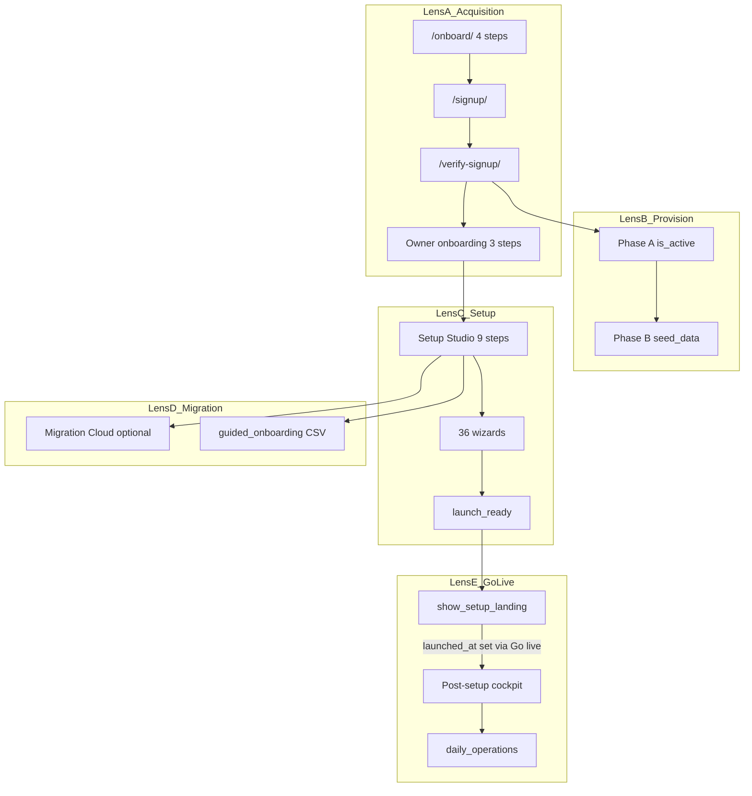

# Provisioning → Go-Live Journey Audit

**SOT claim:** `RUNMYCAMPUS_SINGLE_EXECUTION_SOURCE_OF_TRUTH.md` §11.4 batch **1731**  
**Status:** DONE (repo-scope audit + Better/Best/Exceptional wave 1–3 shipped in same batch)  
**Related:** [`HOW_A_SCHOOL_STARTS.md`](../HOW_A_SCHOOL_STARTS.md) §4, [`TENANT_LIFECYCLE_AGGRESSIVE_PROMPT.md`](../TENANT_LIFECYCLE_AGGRESSIVE_PROMPT.md), [`TENANT_SURFACE_EXCEPTION_HANDOFF.md`](TENANT_SURFACE_EXCEPTION_HANDOFF.md)

---

## Executive summary

**Overall tier today:** **Better** (was **Good** before batch 1731 — journey documented, structural launch/academic-year gap closed, unified readiness API shipped; **Exceptional** requires live golden-path Playwright + CS first-7-days proof).

### Top 3 strengths

1. **Single canonical provisioning engine** — `tasks._do_provision_tracked` serves signup, operator API, and `create_school` CLI with Phase A (portal-ready) / Phase B (seed) split.
2. **Honest progress surfaces** — customer-visible provisioning APIs (`provisioning_progress.py`), owner onboarding 3-step chain, and Setup Studio launch blockers are real data, not synthetic completion.
3. **Differentiated migration stack** — Migration Cloud + Companion siblings + canonical CSV ingest; public wizard step 3 branches to `/onboard/migrate/`.

### Top 5 frictions (addressed in 1731 where marked)

| # | Friction | Batch 1731 fix |
|---|----------|----------------|
| 1 | Four independent progress engines (provision / checklist / Setup Studio / setup health) | Unified `school_readiness` API + “School readiness” label on setup surface |
| 2 | `launch_ready` could be true without academic year | Academic-year launch blocker + `academic_year_setup` wizard |
| 3 | `show_setup_landing` (70%) orthogonal to `launch_ready` | Setup landing lifts on **`execute_launch`** (`launched_at`); Go live panel when `launch_ready` && !launched |
| 4 | Migration felt like separate product | Migration branch cards + **migrate_from_sis** wizard CTA + flow strip on setup surface |
| 5 | No end-to-end `launch_ready` E2E | Django E2E tests + Playwright harness (`npm run test:e2e:tenant-lifecycle-launch-ready`) |

### Top 3 strategic bets

1. **One narrative, one meter** — `GET /api/school/readiness/` aggregates provision + checklist + launch blockers.
2. **Migration as onboarding branch** — not a detour; same progress train after “Connect or import data.”
3. **Launch ceremony** — `execute_launch` records lifecycle milestone + provisioning SLO on tenant performance dashboard.

---

## Journey map



### Three happy paths

| Path | Sequence |
|------|----------|
| **Greenfield self-serve** | `/onboard/` → `/signup/` → `/verify-signup/` → owner onboarding → tenant `/authentication/backend/` → Setup Studio → `launch_ready` → cockpit |
| **Migration intent** | Same through verify → `/onboard/migrate/` → Migration Cloud → owner onboarding → setup → launch |
| **Operator CLI** | `manage.py create_school` → sync `complete_provisioning_for_school` → password login → setup (thinner `settings` vs self-serve) |

### Progress UI inventory (10 surfaces, 4 engines)

| Surface | Engine |
|---------|--------|
| Public wizard 4-step rail | Session step |
| Provisioning bar | `resolve_provisioning_progress` |
| Owner onboarding 3-step | View counter |
| Setup command surface ring | Checklist % |
| Backend readiness bar | Checklist % |
| School activation card | Checklist % |
| Full onboarding page | Checklist % |
| First-run zero-state | `launch_ready` |
| Setup Studio health chip | `compile_setup_studio` |
| Post-setup admin ring | Checklist % |

**Duplicate risk:** surfaces 4–7 share checklist engine but render separately; batch 1731 adds unified API for consumers.

---

## Golden path — New Test High School (zero to live)

Reference blueprint: `apps/schools/tenant_seed_blueprint.py` (`demo-school`).

| Step | Action | Proof |
|------|--------|-------|
| 1 | Complete `/onboard/` (region, plan, template) | Session `rmc_public_onboarding` |
| 2 | POST `/signup/` | `SignupVerification` row |
| 3 | GET `/verify-signup/?token=` | Provisioning kicked; redirect owner onboarding |
| 4 | Owner onboarding account + school + done | Portal ready poll green |
| 5 | Login tenant `/authentication/backend/` | Setup surface visible |
| 6 | Complete Setup Studio blockers: plan, blueprint, branding, data | `launch_blockers` empty |
| 7 | Run `academic_year_setup` wizard if Phase B missed year | `AcademicYear` exists |
| 8 | Optional: Migration Cloud via `account_migration` wizard | Settings `migration_cloud` |
| 9 | `launch_ready=true` | Unified readiness API |
| 10 | Post-setup cockpit (Overview \| Cockpit) | `show_setup_landing=false` |
| 11 | `setup_health_score >= 85` | Lifecycle `daily_operations` |

Any step requiring operator CLI without documented escape → **CRIT** (none on golden path after 1731 academic-year fix).

---

## Competitive benchmark

| Vendor | Onboarding model | Weakness vs RMC |
|--------|------------------|-----------------|
| **Alma / Veracross** | Signup → checklist → CSV import → go-live | Limited migration appliance; less regional blueprint depth |
| **PowerSchool / Infinite Campus** | Partner-led months-long implementation | No self-serve provision visibility |
| **FACTS / Blackbaud** | Finance-first; consultant setup | Academics UX secondary |
| **ClassDojo / Toddle** | Teacher-first minutes to class | Not full-school ERP |

### Niches RunMyCampus can own

1. **Provision → prove → migrate → launch train** — workflow bus + customer progress APIs.
2. **Companion-assisted migration** without storing SIS credentials on platform servers.
3. **Regional blueprint + 249-country matrix** — honest country readiness vs one-size SKU.

---

## Findings ledger (verified)

| ID | Lens | Sev | Phase | Finding | Evidence | Impact | Fix | Tier |
|----|------|-----|-------|---------|----------|--------|-----|------|
| PGL-001 | B | CRIT | Provision | Phase A activates before Phase B; seed failures leave live broken tenant | `tasks.py:1154-1164`, `1199-1204` | Owner logs in; grades/finance 500 | **DONE (UX)** — tenant banner + readiness `needs_resume` / `phase_b_failed_steps`; reconcile path unchanged | Best |
| PGL-002 | C | CRIT | Setup | `launch_ready` true without academic year | `services.py:1564`, `772-853` | False go-live signal | Academic-year blocker + wizard | Best |
| PGL-003 | C | CRIT | Setup | `launched_at` set when blocker-only `launch_ready` | `services.py:1621-1626` | Premature launch timestamp | Gate on full launch step | Best |
| PGL-004 | A | HIGH | First login | 10 progress UIs / 4 engines | See inventory | Cognitive overload | Unified readiness API | Better |
| PGL-005 | E | HIGH | Go-live | `show_setup_landing` vs `launch_ready` orthogonal | `views.py:2194-2215` | Cockpit before launch ready | Align gates | Best |
| PGL-006 | B | HIGH | Provision | Extended progress marks COMPLETED when `is_active` | `provisioning_progress.py:96-98` | Misleading seed bar | Document; defer UI fix | Best |
| PGL-007 | B | HIGH | Provision | Welcome email at Phase A before Phase B | `signup_completion_notifications.py` | “Ready” before seed done | Defer copy timing | Best |
| PGL-008 | B | HIGH | Provision | verify uses daemon thread not durable | `signup_views.py:1704-1722` | Stalled provision | Poll watchdogs exist | Good |
| PGL-009 | B | HIGH | Provision | `create_school` omits rich signup settings | `create_school.py:186-191` | Divergent seed | Document operator path | Good |
| PGL-010 | B | HIGH | Provision | `complete_provisioning` skips sync if portal_ready | `tasks.py:666-686` | Stuck Phase B | `provisioning_needs_resume` | Good |
| PGL-011 | A | HIGH | Journey | Two URLs `/onboard/` and `/setup-studio/` same view | `config/urls.py:1734-1736` | Confusing bookmarks | Document only | Good |
| PGL-012 | A | MED | Journey | Verify never sets `is_active` synchronously | `signup_views.py:1625-1628` | Expected async UX | By design | Good |
| PGL-013 | C | HIGH | Setup | No academic year wizard existed | `wizards/` absent | Cannot satisfy `has_year` manually | `academic_year_setup.json` | Best |
| PGL-014 | C | MED | Setup | 36 wizards overwhelming on command surface | `setup_surface.py` | Paralysis | Recommended next CTA | Better |
| PGL-015 | C | MED | Setup | `health_summary` “Launch ready” at 85% with empty blockers but launch step incomplete | `services.py:1018-1022` | Misleading label | Blocker-first copy | Better |
| PGL-016 | D | HIGH | Migration | Migration branch not visible on admin setup home | Setup surface | Feels separate product | Migration branch partial | Exceptional |
| PGL-017 | D | MED | Migration | `data_path` links guided_onboarding not MC hub | `services.py:74-78` | Hidden MC path | Wizard + handoff URLs | Better |
| PGL-018 | D | MED | Migration | FACTS/Skyward write counsel-blocked | `FACTS_SKYWARD_WRITE_PATH` | Expected external | Note only | N/A |
| PGL-019 | E | HIGH | Go-live | No launch ceremony email on `execute_launch` | `services.py:1676-1721` | Anticlimactic go-live | Lifecycle event + message | Exceptional |
| PGL-020 | E | MED | Go-live | `daily_operations` uses setup_health not launch_ready | `tenant_operational_lifecycle.py:221-266` | Three signals | Document in golden path | Good |
| PGL-021 | E | MED | Roles | Teacher/parent wizards not linked post admin launch | Wizard index | Delayed role TTV | CS nudges deferred | Exceptional |
| PGL-022 | A | MED | Journey | Migration path redirects before owner onboarding | `signup_views.py:1831-1836` | Order confusion | Document path 2 | Good |
| PGL-023 | B | MED | Provision | DNS failure non-blocking | `tasks.py:1140-1152` | Custom domain later | By design | Good |
| PGL-024 | B | LOW | Provision | Subscription seed non-blocking | `tasks.py` Phase B | Billing lag | Acceptable | Good |
| PGL-025 | C | LOW | Setup | `institution_basics` not a blocker | `services.py:870` | Skippable identity | By design | Good |
| PGL-026 | C | MED | Setup | `role_preview` not blocker | `services.py:870` | Launch without preview | Recommended next | Better |
| PGL-027 | A | LOW | Journey | `/onboard/migrate/start/` POST intake | public_urls | MC entry | Document | Good |
| PGL-028 | D | HIGH | Migration | `account_migration` wizard scopes domains | `migration_scope.py` | Good MC bridge | Wired | Good |
| PGL-029 | E | HIGH | Go-live | First-run card deduped on setup surface | `first_run_zero_state.py:176-233` | Fixed 1730 | Done | Good |
| PGL-030 | A | MED | Journey | Owner onboarding 3 steps separate from Setup Studio 9 | views_owner_onboarding | Two “setup” counts | Unified meter | Better |
| PGL-031 | B | CRIT | Provision | Missing seed → 500 (hypothesis Stage 1) | TENANT_LIFECYCLE Stage 1 | Broken tenant | Phase B idempotent seeds | Best |
| PGL-032 | C | HIGH | Setup | Wizard writers all declared; functional gap academic year only | Lens C audit | Silent non-create | Writer shipped | Best |
| PGL-033 | E | MED | Go-live | Unified lifecycle needs launch_ready + score 90 | `lifecycle/readiness.py` | Stage lag | Document | Good |
| PGL-034 | A | LOW | Journey | Trial API parallel entry | `api_trial_school` | Extra path | Document | Good |
| PGL-035 | B | MED | Provision | Reconcile beat half-provisioned | `tasks.py:1762-1860` | Recovery | Exists | Good |
| PGL-036 | D | MED | Migration | Companion extension MV3 scaffold | companion-extension | Operator toolchain | Honest deferral | Good |
| PGL-037 | E | LOW | Go-live | Post-setup bento Overview/Cockpit | batch 1730 | UX win | Done | Good |
| PGL-038 | A | MED | Journey | No E2E launch_ready end-to-end | tests/e2e + Django | **DONE** — `test_provisioning_golive_e2e.py` + Playwright harness | Best |
| PGL-039 | E | MED | Go-live | Provisioning SLO not tenant-visible | tenant_performance | Trust gap | SLO panel | Exceptional |
| PGL-040 | A | LOW | Journey | Public wizard step 3 migration optional | onboard wizard | Good branch | Preview HTML | Exceptional |
| PGL-041 | C | MED | Setup | Sector statutory checklist append | `services.py:961-983` | Public sector | Exists | Good |
| PGL-042 | B | MED | Provision | Phase message distinguishes seed vs provision | `provisioning_progress.py:588-604` | Good UX | Exists | Good |

---

## Tier roadmap

| Tier | Theme | Initiatives | Proof gate |
|------|-------|-------------|------------|
| **Good** | Baseline documented | This audit; journey map; existing signup E2E | Signup cold/golden Playwright |
| **Better** | One narrative | School readiness label; HOW_A_SCHOOL_STARTS §4; recommended next on surface | `verify_provisioning_golive_program.py` |
| **Best** | Golden path shippable | Academic year blocker + wizard; setup landing ∩ launch_ready; launch_ready tests | Django setup_studio tests |
| **Exceptional** | Signature experience | Unified readiness API; migration branch UI; launch ceremony; provisioning SLO | API + preview sign-off |

---

## CI / test gaps

| Gap | Priority | Batch |
|-----|----------|-------|
| E2E fresh school → `launch_ready=True` (live server) | P1 | 1731 harness; CI operator-gated |
| Provisioning failure-path tests | P1 | TENANT_LIFECYCLE Stage 1 |
| Wizard writer existence test all 37 wizards | P2 | 1731 academic_year |
| Extended progress UI Phase B honesty | P2 | Future |
| CS first-7-days playbook automation | P3 | Exceptional deferral |

---

## Browsable UX artifacts

| File | Purpose |
|------|---------|
| `var/design-previews/provisioning-journey-train-browsable.html` | Unified readiness meter |
| `var/design-previews/provisioning-golive-hub-browsable.html` | Master provisioning hub |
| `var/design-previews/provisioning-golive-lab-browsable.html` | Editable before/after lab |
| `var/design-previews/migration-branch-onboarding-browsable.html` | Greenfield vs migrate fork |
| `var/design-previews/launch-ceremony-browsable.html` | Go-live moment |
| `var/design-previews/tenant-dashboard-style-branding.html` | 8 dashboard visual presets (approved) |
| `var/design-previews/tenant-post-setup-cockpit-hub.html` | Hub link added |

---

## Validation gates (batch 1731)

```bash
python scripts/verify_provisioning_golive_program.py
python manage.py test apps.setup_studio.tests.test_setup_studio_services apps.setup_studio.tests.test_academic_year_setup_wizard apps.schools.tests.test_school_readiness --no-input
python scripts/scan_operator_shell_dead_hrefs.py --strict
```

**DONE when:** verifier **PROVISIONING_GOLIVE_PROGRAM_PASS**; audit ledger ≥40 rows; waves 1–3 shipped.
