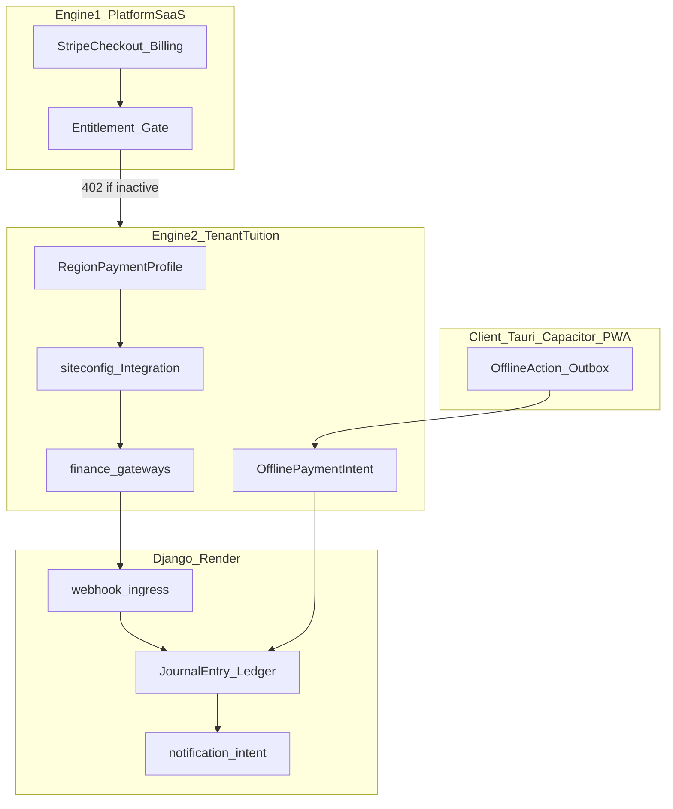

# Sovereign Financial Delivery Platform (SFDP) — Dual-Engine execution plan

**Status:** **DONE (Lane 1 repo-scope)** — **SOVEREIGN_FINANCIAL_DELIVERY_COMPLETE** (2026-05-23)
**Plan owner:** RunMyCampus platform billing + finance
**Created:** 2026-05-23
**Target SW range:** `sms-v3.74.0` → `sms-v3.80.x`
**Batch IDs:** **1420** (program) → **1421–1431** (implementation waves)
**Absorbs / extends:** SOT batch **1171** (WAfrica corridor readiness — Lane 2 evidence); builds on **1414–1417** (Stripe Connect repo-complete)
**Handoff-ready for:** Claude Code, Codex, Cursor — single build contract; do not spawn parallel payment strategy docs

**Canonical cross-links (extend, do not replace):**

- [`docs/plans/STRIPE_CONNECT_PLATFORM_SETTLEMENT_PLAN.md`](STRIPE_CONNECT_PLATFORM_SETTLEMENT_PLAN.md) — Engine 1 platform revenue
- [`docs/plans/SOVEREIGN_OFFLINE_ONLINE_DELIVERY_PLATFORM_PLAN.md`](SOVEREIGN_OFFLINE_ONLINE_DELIVERY_PLATFORM_PLAN.md) — offline outbox (NOT PouchDB ledger)
- [`docs/payments/PSP_API_CONNECTION_GUIDE.md`](../payments/PSP_API_CONNECTION_GUIDE.md)
- [`docs/payments/PAYMENT_BLOCKER_CLASSIFICATION.md`](../payments/PAYMENT_BLOCKER_CLASSIFICATION.md)
- [`docs/external_dependencies_register.json`](../external_dependencies_register.json)
- [`apps/billing/psp_adapter_registry.py`](../../apps/billing/psp_adapter_registry.py)
- [`apps/finance/payment_region_catalog.py`](../../apps/finance/payment_region_catalog.py)
- [`apps/finance/data/regional_payment_profiles.json`](../../apps/finance/data/regional_payment_profiles.json)

---

## 0 — Executive summary

RunMyCampus ships **two financial engines** on one Django hub:

| Engine | Who pays whom | Rails | Settlement |
|---|---|---|---|
| **Engine 1 — Platform SaaS** | School → RunMyCampus | Stripe Checkout + Connect (1414–1417) | Platform balance / application fee |
| **Engine 2 — Tenant tuition** | Parent → School | Country matrix: Paystack, Flutterwave, MTN MoMo, Orange Money, cash/proof | School connected account or tenant PSP keys |

**Pilot corridors (parallel, non-negotiable):** **NG**, **GH**, **CM** — repo-complete adapters + parent checkout UX + webhook normalizer before claiming corridor-live.

**10x global-local mandate (2026-05-23):** SFDP must feel **country-native in 200+ countries** and still operate as one global financial platform. Coverage is not only an ISO2 row count. Every supported market must expose local currency, locally familiar payment rail names, receipt language, offline/cash fallback posture, operator readiness, evidence status, and escalation rules while global operators retain one ledger, one PSP registry, one webhook normalizer, one entitlement gate, and one evidence discipline.

| Completion tier | Meaning | Required for repo pass |
|---|---|---|
| Lane 1 repo | Code, tests, docs, verifiers are present and green | Yes |
| Lane 2 live evidence | Actual PSP keys and external corridor proof artifacts | No, but must be documented honestly |
| Lane 3 local-global force | 200+ market-native UX + one global control plane + evidence-grade validation | Planned next acceleration |

**What we explicitly REJECT** (security / audit — do not relitigate):

1. **PouchDB / CouchDB client financial ledger** — money posts via server `JournalEntry` + `OfflinePaymentIntent`; clients queue `OfflineAction` / Dexie outbox only.
2. **`float` for money** — `Decimal` only; `scan_money_float` baseline 0.
3. **Client `send_mail` / SMTP in sync payloads** — `schoolops.notification_intent` + `send_transactional` / SMS templates.
4. **Public webhooks without signature verify** — `apps/finance/webhook_ingress.py` + per-provider verifiers.
5. **New `TenantProfile` / inline plaintext API keys** — `schools.School`, `siteconfig.Integration`, encrypted fields.
6. **P2P mDNS payment mesh** — mDNS is hub discovery only (`LOCAL_HUB_MODE.md`).
7. **Fabricating `verified_live` in external register** — Lane 2 evidence paths only.

---

## 0.1 — Assumptions and risks

- **Assumption:** Lane 1 completion is repo-limited; live PSP key activation and corridor evidence are Lane 2 handoff items.
- **Assumption:** NG/GH/CM corridors are the minimum launch set; additional corridors should reuse the same catalog and webhook architecture.
- **Risk:** live PSP key access is unavailable in time; mitigate by mocking proof and documenting Lane 2 secrets/tokens separately.
- **Risk:** country/regional policy drift causes profile mismatch; mitigate with a strong drift test and review cadence for `regional_payment_profiles.json`.
- **Risk:** webhook normalization misses provider-specific edge cases; mitigate with layered canonical schema + provider-specific test fixtures.
- **Risk:** operator live evidence is claimed without artifacts; mitigate by requiring `var/evidence/geos-99/psp/<provider>/README.md` before `verified_live`.

## 0.2 — What this plan does not cover

- Full global regulatory compliance for every market beyond payment gateway carrier readiness.
- PSP key activation and merchant KYB/production onboarding for Lane 2 pilot corridors.
- Multi-currency pricing and statement descriptor engineering beyond the tuition/payment flow baseline.
- Refund, dispute, and chargeback lifecycle beyond the payment success + ledger apply path.
- New payment orchestration engines, client-side financial ledger replication, or any data mesh that stores money-state off the server.

## 1 — Non-negotiable architecture rules (12)

1. **Server-authoritative ledger** — `post_invoice_to_ledger` / `post_payment_to_ledger` in `apps/finance/services.py`; idempotent by reference.
2. **Tenant scope** — every queryset/API uses `request.school` / `schema_context`; never trust body `tenant_id`.
3. **Country at provision** — normalize ISO-2 on school create; bind `TenantPaymentPolicy` + `RegionPaymentProfile`.
4. **Credentials in Integration** — `siteconfig.Integration` slugs per PSP; no secrets in templates or commits.
5. **Offline cash/proof** — `OfflineActionType.PAYMENT_PROOF` → `OfflinePaymentIntent` → bursar `reconcile_offline_payment_intent` (manual_review for conflicts).
6. **Subscription gate** — inactive `BillingAccount` / entitlement → HTTP 402 on finance **writes** (document cash-queue exception).
7. **Webhook dedupe** — `webhook_ingress.resolve_webhook_dedup_bucket` + idempotent payment apply.
8. **PSP registry truth** — flip `psp_adapter_registry.adapter_status` to `live` only with tests + operator route proof.
9. **Regional JSON + catalog parity** — `regional_payment_profiles.json` must match `CANONICAL_PAYMENT_ORCHESTRATION_ISO2`.
10. **Notification intents** — payment receipt = intent type `payment.received` (email + SMS locale templates).
11. **Lane honesty** — repo-complete ≠ corridor-live; matrix stays honest until GEOS evidence.
12. **Single SOT** — update `RUNMYCAMPUS_SINGLE_EXECUTION_SOURCE_OF_TRUTH.md` §11.4 + autonomous log **after** green verifiers per wave.

---

## 2 — Wave map (mandatory order)

| Batch | Wave | Goal | Primary proof |
|---|---|---|---|
| **1420** | Program | This plan + SOT reservation + absorb 1171 pointer | Plan exists; SOT row |
| **1421** | Contract freeze | Envelope schema, subscription gate matrix, scaffold verifier | `SOVERIGN_FINANCIAL_DELIVERY_SCAFFOLD_PASS` |
| **1422** | Provision bind | `bind_tenant_payment_policy_for_school` on provision/signup | Django tests provision + policy |
| **1423** | Catalog parity | JSON profiles for UG/TZ/RW/ZA/CI/SN/CD + drift test | `test_payment_region_catalog_expansion` |
**Verified:** `verify_sovereign_financial_delivery_scaffold.py` + `verify_sovereign_financial_delivery_completion.py` are green for repo artifacts.
| **1424** | Integration wizard | Country-aware PSP setup UI + readiness links | Route resolve + template tests |
| **1425** | Cash desk | Offline proof UX, bursar queue, receipt PDF | `test_offline_queue` payment_proof + reconciliation |
| **1426** | Entitlement gate | 402 middleware on finance writes | Middleware tests |
| **1427** | NG corridor | Paystack harden + parent MoMo/card UI | Gateway tests + registry `paystack` |
| **1428** | GH corridor | MTN + Paystack scaffold live | Gateway tests |
| **1429** | CM corridor | Flutterwave + Orange + MTN | Gateway tests |
| **1430** | Webhook normalizer | Unified success schema across PSPs | Webhook idempotency tests |
| **1431** | Notifications closeout | SMS `payment.received` intents + program verifier bundle | Intent tests + full scaffold PASS |

**Lane 2 (operator — parallel, not blocking repo-complete):** batches **1170** (Stripe live), **1171** (absorbed by 1427–1429 + register evidence), **1174** (live payment evidence).

---

## 3 — Definition of done (100% repo)

### Per-wave (every batch 1421–1431)

- [ ] Code + tests merged for wave scope only (smallest diff)
- [ ] Named verifier(s) for wave → **PASS**
- [ ] `python manage.py check` clean
- [ ] `makemigrations --dry-run --check` → no unexpected drift
- [ ] Zero-tolerance scanners unchanged at 0 (especially `scan_money_float`, `scan_tenant_queryset_safety`, `scan_pii_logging_smell`)
- [ ] SOT §11.4 row → **DONE (Lane 1)** + autonomous log A–F
- [ ] SW bumped when static/template touched

### Program complete (batch 1431)

- [ ] `python scripts/verify_sovereign_financial_delivery_scaffold.py` → **SOVEREIGN_FINANCIAL_DELIVERY_SCAFFOLD_PASS**
- [ ] `python scripts/verify_sovereign_financial_delivery_completion.py` → **SOVEREIGN_FINANCIAL_DELIVERY_COMPLETE** (all waves)
- [ ] `psp_adapter_registry`: stripe `in_progress`→`live` where proof exists; paystack/flutterwave/mtn_momo/orange_money at least `in_progress` with tests
- [ ] `generate_external_dependencies_register.py --write` (honest statuses)
- [ ] `generate_system_closure_map.py --write`
- [ ] Batch **1171** SOT row updated: **PARTIAL CLOSED (Lane 1)** — Lane 2 evidence deferred
- [ ] No new parallel strategy markdown

---

## 4 — Scale acceleration and 10x execution

### 4.1 Platform leverage priorities
- Use the sovereign finance execution to create a single, audit-safe channel for both platform SaaS fees and tenant tuition receipts.
- Build a unified source of truth for every payment event: provider webhook → normalized event → idempotent ledger post → notification intent.
- Make PSP readiness a product surface: show operator-assigned primary/backup rails, proof status, and live fallback health.
- Turn offline payment proof into an onboarding signal for unbanked corridor readiness rather than a deferred exception.

### 4.2 10x growth levers
- Add adaptive rail recommendation by corridor: start with NG/GH/CM, then lock in one more West Africa pack and one East Africa pack by reusing `regional_payment_profiles.json` templates.
- Add settlement visibility in the workflow: expected payout date, status, and reconciliation gap per school.
- Measure success in four product KPIs: payment success rate, settlement accuracy, operator dispute cycle time, and cash-proof reconciliation velocity.
- Embed trust signals in the parent checkout and bursar flows: local currency labels, native mobile money rails, SMS receipt promises, and proof upload UX.

### 4.3 World-class reliability and compliance
- Enforce server-authoritative ledger and no client-side money model; this is the foundation for scale and auditability.
- Treat `subscription_gate` and entitlement middleware as a safety moat for every finance write path.
- Elevate webhook security: per-provider signature verification, replay/dedupe buckets, and canonical event normalization.
- Harden data protection: no plaintext PSP secrets in UI/templates, no float in money, no client email SMTP payloads.

### 4.4 Operational readiness
- Maintain evidence artifacts for each wave and wire them into `verify_phases_3_11_gates.py` at batch **1431**.
- Publish the corridor evidence templates in `var/evidence/geos-99/psp/` so live PSP key validation is traceable.
- Keep the roll-forward program visible in `RUNMYCAMPUS_SINGLE_EXECUTION_SOURCE_OF_TRUTH.md` §11.4 and use `SOT` rows as the single source of progress truth.
- Document any lane-specific live key dependencies separately from repo-scope completion, so Lane 1 stays clean and Lane 2 evidence is honest.

### 4.5 Next gear extension roadmap
- Phase A: Add unified refund/dispute flow and reconciliation ticket tracking for PSP failures and offline proof exceptions.
- Phase B: Add intelligent retry/fallback routing between matched rails for the same corridor and local currency.
- Phase C: Add receivables aging, payment forecast, and settlement reserve guidance for operators.
- Phase D: Add multi-currency pricing support with currency selection and local statement descriptions for parent checkout.

---

## 5 — Verifier registry (planned)

| Script | Introduced | Pass string |
|---|---|---|
| `verify_sovereign_financial_delivery_scaffold.py` | 1421 | `SOVEREIGN_FINANCIAL_DELIVERY_SCAFFOLD_PASS` |
| `verify_sovereign_financial_delivery_completion.py` | 1431 | `SOVEREIGN_FINANCIAL_DELIVERY_COMPLETE` |
| `verify_stripe_platform_settlement_scaffold.py` | (1415) | `STRIPE_PLATFORM_SETTLEMENT_SCAFFOLD_PASS` |
| `verify_sovereign_offline_depth.py` | (1413+) | `SOVEREIGN_OFFLINE_DEPTH_PASS` |

Wire scaffold + completion into `scripts/verify_phases_3_11_gates.py` at batch **1431**.

---

## 6 — BUILD AGENT PROMPT (copy everything below — execute until 100%)

```
You are the RunMyCampus Sovereign Financial Delivery Platform (SFDP) build agent.

MISSION: Execute batches 1420→1431 wave-by-wave until Lane 1 repo scope is 100% complete.
Do NOT stop after one wave. Do NOT stop at "handoff ready." Do NOT write plan-only output.
After each wave: run proof commands; only then mark SOT DONE and continue to the next wave.
If a wave fails validation: fix and re-run until PASS before advancing.

═══════════════════════════════════════════════════════════════════════════════
READ FIRST (mandatory — no parallel strategy docs)
═══════════════════════════════════════════════════════════════════════════════
- docs/plans/SOVEREIGN_FINANCIAL_DELIVERY_PLATFORM_PLAN.md (this file)
- docs/plans/STRIPE_CONNECT_PLATFORM_SETTLEMENT_PLAN.md (Engine 1 — already repo-complete 1414-1417)
- docs/plans/SOVEREIGN_OFFLINE_ONLINE_DELIVERY_PLATFORM_PLAN.md (offline outbox — reuse, no PouchDB)
- docs/RUNMYCAMPUS_SINGLE_EXECUTION_SOURCE_OF_TRUTH.md §11.4 + §12
- docs/RUNMYCAMPUS_AUTONOMOUS_EXECUTION_LOG.md
- docs/external_dependencies_register.json (payments_psp_settlement section)
- docs/payments/PSP_API_CONNECTION_GUIDE.md
- docs/payments/PAYMENT_BLOCKER_CLASSIFICATION.md
- apps/billing/models.py (BillingAccount, Entitlement)
- apps/billing/psp_adapter_registry.py
- apps/finance/models.py (JournalEntry, Invoice, OfflinePaymentIntent, TenantPaymentPolicy, RegionPaymentProfile)
- apps/finance/services.py, payment_orchestration.py, payment_region_catalog.py
- apps/finance/gateways/, webhook_ingress.py, webhooks/signature_verifiers.py
- apps/finance/data/regional_payment_profiles.json
- apps/platform_runtime/offline_action_types.py, offline_queue.py
- apps/sync_engine/conflict_resolver.py (payment_proof → MANUAL_REVIEW)
- apps/schoolops/notification_intent.py
- apps/siteconfig/models_tooling.py (Integration)

═══════════════════════════════════════════════════════════════════════════════
NON-NEGOTIABLES (violation = stop and fix before next wave)
═══════════════════════════════════════════════════════════════════════════════
1. NO PouchDB/CouchDB/client double-entry ledger for money.
2. NO float() on amounts — Decimal only.
3. NO client send_mail; use notification intents + send_transactional / SMS templates.
4. NO @csrf_exempt payment webhooks; signature verify + dedupe required.
5. NO new TenantProfile/TenantPaymentMatrix with inline secrets — use School + Integration.
6. NO verified_live in external_dependencies_register without evidence file path.
7. NO claiming corridor-live / GEOS live% — repo-complete language only until operator evidence.
8. NO skipping SOT §11.4 + autonomous log update after a green wave.
9. NO stopping because "next wave is templates" or "needs new row" — add row and continue.
10. Tenant isolation on every finance write/read path.

═══════════════════════════════════════════════════════════════════════════════
AUTONOMOUS LOOP (run until SOVEREIGN_FINANCIAL_DELIVERY_COMPLETE)
═══════════════════════════════════════════════════════════════════════════════
FOR each batch IN [1420, 1421, 1422, 1423, 1424, 1425, 1426, 1427, 1428, 1429, 1430, 1431]:
  1. Claim batch in SOT §11.4 (one line) before coding.
  2. Implement wave deliverables only (smallest diff; match existing patterns).
  3. Run WAVE PROOF (below) — all must pass.
  4. Run GLOBAL GATES (below) — all must pass.
  5. Update SOT §11.4 → DONE (Lane 1) + RUNMYCAMPUS_AUTONOMOUS_EXECUTION_LOG.md A–F.
  6. If static/JS/templates changed: bump static/js/service-worker.js CACHE_VERSION monotonically.
  7. Continue to next batch — do not ask user to pick next wave.

ONLY stop when:
  - scripts/verify_sovereign_financial_delivery_completion.py → SOVEREIGN_FINANCIAL_DELIVERY_COMPLETE
  - OR true blocker: missing live PSP secret that cannot be mocked in tests (document BLOCKED in SOT, continue other waves if independent)

═══════════════════════════════════════════════════════════════════════════════
WAVE DELIVERABLES (implement exactly — do not skip)
═══════════════════════════════════════════════════════════════════════════════

BATCH 1420 — Program reservation
- Ensure this plan file is canonical.
- Add SOT §11.4 batch 1420 row (program + wave map 1421-1431).
- Point batch 1171: "absorbed by SFDP 1427-1429; Lane 2 evidence unchanged."
- No code required unless plan was missing.

BATCH 1421 — Contract freeze
- scripts/verify_sovereign_financial_delivery_scaffold.py
  → SOVEREIGN_FINANCIAL_DELIVERY_SCAFFOLD_PASS
  Checks: plan exists; psp registry importable; payment_region_catalog ISO2 set non-empty;
  regional_payment_profiles.json parseable; offline PAYMENT_PROOF type exists;
  webhook_ingress importable; no PouchDB refs in apps/ or static/ finance paths.
- Document subscription gate matrix in plan §1 or apps/billing/README fragment:
  which finance writes return 402 when entitlement inactive.
- scripts/verify_sovereign_financial_delivery_completion.py (stub listing waves 1422-1431; fails until all done)

BATCH 1422 — Provision bind
- apps/finance/payment_provision.py (or extend payment_region_catalog):
  bind_tenant_payment_policy_for_school(school) — idempotent create TenantPaymentPolicy from
  school country → RegionPaymentProfile.
- Hook: schools provision / rapid create / super_views_provisioning after country known.
- Tests: provision NG/GH/CM schools get correct primary_rail hints.

BATCH 1423 — Catalog parity
- Enrich apps/finance/data/regional_payment_profiles.json for any ISO2 in
  CANONICAL_PAYMENT_ORCHESTRATION_ISO2 missing rich copy (UG, TZ, RW, ZA, CI, SN, CD).
- Extend apps/finance/tests/test_payment_region_catalog_expansion.py — drift guard:
  every canonical ISO2 has profile + primary_rail in JSON.

BATCH 1424 — Integration wizard
- Country-aware operator setup: extend finance:payment_readiness_setup and/or siteconfig
  Integration forms — show PSP fields for school's seeded primary/backup from policy.
- Link from onboarding_step_catalog finance.payment_gateway step.
- Tests: URL resolve + template contains rail labels for CM vs NG.

BATCH 1425 — Sovereign cash desk
- Parent: invoice proof upload offline-capable (data-rmc-offline-form or PAYMENT_PROOF enqueue).
- Operator: bursar queue view for OfflinePaymentIntent QUEUED_REVIEW (paginated, .rmc-data-table).
- Wire reconcile_offline_payment_intent → post_payment_to_ledger on approve.
- Optional: print-ready receipt partial (reuse rmc-print-v2 tokens).
- Tests: test_offline_queue payment_proof + reconciliation idempotency.

BATCH 1426 — Entitlement gate
- Middleware or mixin: finance write views/APIs check billing entitlement active → 402 JSON/HTML.
- Document exception: cash/proof QUEUE may be allowed when policy.allow_cash — test both paths.
- Tests: inactive subscription blocks POST payment apply; active allows.

BATCH 1427 — NG corridor (Paystack)
- Harden apps/finance/gateways/paystack.py (initiate, verify, webhook normalize).
- Parent checkout: MoMo + bank + card labels from regional profile NG.
- psp_adapter_registry: paystack → in_progress with proof_model/proof_route if tests green.
- Tests: mocked HTTP + webhook signature + idempotent ledger post.
- var/evidence/geos-99/psp/paystack/ README template (Lane 2)

BATCH 1428 — GH corridor
- MTN MoMo + Paystack paths for GH; registry rows updated.
- Tests mirroring 1427.

BATCH 1429 — CM corridor
- Flutterwave + orange_money + mtn_momo scaffolds hardened for CM.
- Tests + evidence template path.

BATCH 1430 — Webhook normalizer
- apps/finance/webhooks/normalizer.py — canonical event:
  {provider, event_id, school_id, invoice_id, amount_decimal, currency, status, raw_ref}
- payment_provider_webhook routes all PSPs through normalizer → single apply_payment_success path.
- Tests: fixture per provider → same ledger outcome.

BATCH 1431 — Closeout
- schoolops notification intent payment.received → email + SMS locale (en/fr; ar rtl if template exists).
- verify_sovereign_financial_delivery_completion.py → all waves 1422-1431 checks true.
- Wire both verifiers into verify_phases_3_11_gates.py.
- generate_external_dependencies_register.py --write
- generate_system_closure_map.py --write
- Update batch 1171 → PARTIAL CLOSED (Lane 1)
- SW bump: sms-v3.80.0-sovereign-financial-delivery-complete-2026-05-23 (or next monotonic)

═══════════════════════════════════════════════════════════════════════════════
WAVE PROOF (run after EVERY batch 1421-1431)
═══════════════════════════════════════════════════════════════════════════════
python manage.py check
python manage.py makemigrations --dry-run --check
python scripts/verify_sovereign_financial_delivery_scaffold.py
python manage.py test apps.finance.tests.test_payment_region_catalog_expansion apps.finance.tests.test_global_payment_profiles apps.platform_runtime.tests.test_offline_queue apps.billing.tests.test_regional_payment_readiness --noinput
# Add batch-specific tests as you create them (gateway tests, middleware tests, webhook tests)

═══════════════════════════════════════════════════════════════════════════════
GLOBAL GATES (run after EVERY batch 1421-1431; fix before advancing)
═══════════════════════════════════════════════════════════════════════════════
python scripts/scan_money_float.py --compare
python scripts/scan_tenant_queryset_safety.py --compare
python scripts/scan_pii_logging_smell.py --compare
python scripts/scan_ai_gateway_boundary.py --compare
python scripts/verify_stripe_platform_settlement_scaffold.py
python scripts/verify_sovereign_offline_depth.py
python scripts/verify_doc_plan_density_discipline.py

After batch 1431 only:
python scripts/verify_sovereign_financial_delivery_completion.py
python scripts/verify_phases_3_11_gates.py

═══════════════════════════════════════════════════════════════════════════════
HARD RULES
═══════════════════════════════════════════════════════════════════════════════
- Smallest diff; extend existing modules — no second payment orchestration engine.
- Match Stripe Connect urllib patterns for new PSP HTTP (no new stripe SDK).
- Multi-agent: state "SFDP batch N" in first line to avoid collision.
- Docs after behavior: SOT + log only after green verifiers.
- Do not mark 9.5/10 or "complete platform" — SFDP repo-complete only.

When SOVEREIGN_FINANCIAL_DELIVERY_COMPLETE prints, output a final table:
| Batch | Status | Proof |
and list honest Lane 2 blockers from external_dependencies_register (credentials_needed / waiting_on_provider).

THEN keep going only if user asked for Lane 2 operator evidence — otherwise stop.
```

---

## 6 — Lane 2 (operator / external) — honest blockers

| Register id | Corridor | Repo after SFDP | External action |
|---|---|---|---|
| `stripe_global_cards` | Global | 1415–1417 done | KYB + sk_live + pilot charge |
| `stripe_connect_platform` | Global | 1416–1417 done | Pilot school Connect payout |
| `paystack_wa` | NG, GH | 1427–1428 | Merchant keys + webhook secret |
| `flutterwave_multi_country` | CM, multi | 1429 | FLW live keys + FLW_SECRET_HASH |
| `mtn_momo` | GH, CM, UG | 1428–1429 | Aggregator approval |
| `orange_money` | CM, CI, SN | 1429 | Partner onboarding |

Repo-complete ≠ corridor-live.

---

## 8 — Phase 2: Lane 2 + 10× depth (1432–1450)

**Status:** **DONE (Lane 1 repo-scope)** — **SOVEREIGN_FINANCIAL_PHASE2_COMPLETE** (2026-05-23). Extends **1420–1431** + **Stripe Connect 1415–1417**. **250** ISO2 rows in `regional_payment_profiles.json`. Lane 2 live money remains operator-owned (`verified_live` only with evidence on disk).

**Tie-in:** Engine 1 (`stripe_global_cards`, `stripe_connect_platform`) and Engine 2 (`paystack_wa`, `flutterwave_multi_country`, `mtn_momo`, `orange_money`) share one operator matrix: [`apps/finance/payment_lane2_checklist.py`](../../apps/finance/payment_lane2_checklist.py).

**Verifiers (Phase 2):**

| Script | Pass string |
|---|---|
| `verify_payment_gateway_lane2_scaffold.py` | `PAYMENT_GATEWAY_LANE2_SCAFFOLD_PASS` |
| `verify_dual_engine_financial_program.py` | `DUAL_ENGINE_FINANCIAL_PROGRAM_PASS` |

### 8.1 — Lane 2 operator playbook (cannot fake in git)

For **each** pilot corridor:

1. Merchant KYC + live keys in `Integration(provider=payments)` (never git).
2. `python manage.py check_payment_gateways --school=<slug> --provider=<psp> --mode=production_ping` (Paystack/Flutterwave/Stripe) **or** `--mode=metadata` (MTN/Orange).
3. Supervised live charge + webhook delivery.
4. Copy evidence template → `var/evidence/geos-99/psp/<psp>/phase1_*_evidence.json` (redacted).
5. Flip **child** row in [`docs/external_dependencies_register.json`](../external_dependencies_register.json) to **`verified_live`** only after step 4.
6. Parent row `sfdp_lane2_pilot_corridors` flips when **all** child corridors needed for GEOS pilot are live.

**Proof per corridor:** evidence JSON on disk + register status + optional `PaymentGatewayHealthSnapshot` row from health command.

### 8.2 — Wave map (1432–1450)

| Batch | Focus | Lane | Primary proof |
|---|---|---|---|
| **1432** | Phase 2 program + dual-engine verifier + register parent row | 1 | `DUAL_ENGINE_FINANCIAL_PROGRAM_PASS` |
| **1433** | `payment_lane2_checklist.py` + evidence templates (all PSP dirs) | 1 | `PAYMENT_GATEWAY_LANE2_SCAFFOLD_PASS` |
| **1434** | Wire `dispatch_payment_received_intent` on `apply_payment` (all success paths) | 1 | payment notification tests |
| **1435** | Stripe Connect ↔ tuition: document Engine 1 vs 2 boundary in PSP guide | 1 | guide anchors + scaffold |
| **1436** | Payment readiness dashboard: per-PSP Lane 2 status from register + Integration | 1 | readiness view tests |
| **1437** | Webhook normalizer: Stripe Connect `account.updated` + payment_intent fixtures | 1 | normalizer tests |
| **1438** | NG corridor depth: Paystack metadata contract + idempotency matrix | 1 | gateway tests |
| **1439** | GH corridor depth: MTN callback replay + Paystack fallback | 1 | gateway tests |
| **1440** | CM corridor depth: Flutterwave + Orange dual-rail UX copy | 1 | template + normalizer |
| **1441** | Catalog expansion scaffold: ISO2 generator script (not 200 countries inline) | 1 | drift test extended |
| **1442** | Regional JSON: +10 ISO2 from generator (KE, ET, …) same 1423 pattern | 1 | catalog drift test |
| **1443** | Global PSP gateways: Razorpay/Pesapal/Mercado Pago/dLocal + normalizer + registry `in_progress` | 1 | `test_psp_registry_phase2` + gateway modules |
| **1444** | Counsel-blocked register rows: Paystack subaccounts, FLW split | 1 | register + checklist |
| **1445** | Bursar queue: bulk approve guardrails + audit export | 1 | queue tests |
| **1446** | Finance 402 gate: marketplace addon exemption matrix | 1 | middleware tests |
| **1447** | Health snapshots: corridor rollup for operator super dashboard | 1 | health command tests |
| **1448** | GEOS evidence CI: lane2 scaffold in `verify_phases_3_11_gates.py` | 1 | gates bundle |
| **1449** | SOT + autonomous log Phase 2 closeout (Lane 1) | 1 | SOT rows 1432–1448 |
| **1450** | Phase 2 completion verifier (optional; after 1448 green) | 1 | `SOVEREIGN_FINANCIAL_PHASE2_SCAFFOLD_PASS` |

**Lane 2 batches (operator — parallel):** **1170** (Stripe live), **1171** (WAfrica keys), **1174** (payment evidence) — unchanged; use §8.1 playbook.

### 8.3 — Former deferrals (repo closure 2026-05-23)

| Item | Lane 1 status | Notes |
|---|---|---|
| Razorpay / Pesapal / Mercado Pago / dLocal gateways | **DONE** | `apps/finance/gateways/*` + normalizer + registry `in_progress`; Lane 2 keys → `verified_live` |
| Full **200-country** JSON | **DONE** | `generate_regional_payment_catalog_stubs.py --all-iso2` → **250** keys |
| Paystack **subaccounts** / Flutterwave **split** | **DONE (counsel-gated)** | `payment_marketplace_split.py` + `SFDP_PAYMENT_SPLIT_COUNSEL_TOKEN` |
| Desk-to-desk **client replication** payment mesh | **Rejected (permanent)** | Server `JournalEntry` + `OfflineAction` only — not PouchDB |

### 8.4 — BUILD AGENT PROMPT (Phase 2 kickoff)

```
Execute SFDP Phase 2 batches 1432→1448 from §8.2.
Read payment_lane2_checklist.py + external_dependencies_register.json first.
After each batch: verify_dual_engine_financial_program.py + wave tests.
Do NOT set verified_live without var/evidence/geos-99/psp/* JSON on disk.
Tie Stripe (1415-1417) with Engine 2 corridors in every SOT row.
Stop at 1449 when Lane 1 scaffolding is green; Lane 2 remains operator-owned.
```

---

## 9 — Phase 3: 10x Local-Global Financial Force (1451–1475)

**Status:** **DONE (Lane 1, repo-scope)** — **SOVEREIGN_FINANCIAL_LOCAL_GLOBAL_FORCE_COMPLETE** (2026-05-23). Batches **1452–1475** shipped: enriched 250 ISO2 profiles, rail taxonomy, risk tiers, local checkout partial, receipt i18n, readiness 2.0 Lane 2 matrix, evidence generator, regional depth packs, fee/FX/dispute helpers, global command center, demo seed command, Playwright spec, completion verifier.

**Non-negotiable product bar:** a parent in Lagos, Accra, Douala, Nairobi, São Paulo, Mumbai, Jakarta, Paris, Dubai, Toronto, or a small island state should never feel like they are using a generic US-only payment page with translated labels. The platform must present local currency, local payment vocabulary, rail confidence, fallback expectations, receipt/audit language, support escalation, and offline resilience in a way that feels native to the market and still reports to the global operator with consistent ledger, risk, and evidence semantics.

### 9.1 — Local feeling contract for 200+ countries

Each ISO2 profile must carry or derive the following:

| Contract area | Required local signal | Required global signal |
|---|---|---|
| Currency | ISO currency, symbol/display name, minor-unit precision, amount formatting examples | Decimal-only ledger and normalized amount contract |
| Rails | Primary/backup rails named in local language where appropriate, e.g. MoMo, M-Pesa, Pix, UPI, bank transfer, cash desk | Canonical rail class: card, bank, mobile_money, wallet, voucher, cash, manual_proof |
| Checkout UX | Parent-facing rail cards ordered by local familiarity, not global provider preference | Unified payment intent and webhook normalizer |
| Receipts | Local receipt wording, school receipt number, tax/fee wording, SMS copy, printable format | Immutable receipt reference and `payment.received` notification intent |
| Offline posture | Cash/proof availability, reconciliation owner, low-connectivity guidance | Server `OfflinePaymentIntent` and manual-review audit |
| Operator readiness | Setup steps, required merchant evidence, fallback health, counsel/partner flags | `external_dependencies_register.json` and PSP health snapshot |
| Risk posture | KYC intensity, chargeback/dispute expectations, split-payout restrictions | Global risk tier and no `verified_live` without evidence |
| Locale | Language direction, date/time, term for parent/guardian/sponsor, local fee vocabulary | i18n keys, no hard-coded English-only financial strings |

### 9.2 — Global touch contract

The global layer remains intentionally boring and consistent:

- One server-authoritative ledger (`JournalEntry`) for all money movement.
- One tenant payment policy resolver per school/country.
- One PSP adapter registry with honest statuses: `available`, `in_progress`, `external_required`, `verified_live`.
- One webhook normalizer envelope for every provider and every country.
- One entitlement gate for finance writes, with documented offline/cash exceptions.
- One evidence tree: `var/evidence/geos-99/psp/<provider>/<country>/...`.
- One operator matrix that rolls country, PSP, Integration, live evidence, and health into a single readiness view.
- One UI standard: premium, calm, local-first checkout and bursar flows; no generic table dumps for parent-facing money screens.

### 9.3 — 10x wave map (1451–1475)

| Batch | Focus | Required proof |
|---|---|---|
| **1451** | Phase 3 contract + verifier `verify_sovereign_financial_local_global_force.py` | `SOVEREIGN_FINANCIAL_LOCAL_GLOBAL_FORCE_PASS` |
| **1452** | Enrich profile schema: currency display, minor units, local rail vocabulary, risk tier, locale hints | profile schema test + JSON drift guard |
| **1453** | Rail taxonomy: canonical classes for card, bank, mobile money, wallet, instant bank, voucher, cash, manual proof | taxonomy tests + adapter registry parity |
| **1454** | Local checkout composition: render primary/backup/fallback rail cards from profile metadata | Django template tests + Playwright mobile screenshots |
| **1455** | Receipt localization: country-aware receipt, SMS, email, print labels; no hard-coded English-only payment copy | i18n scan + receipt tests |
| **1456** | Operator readiness 2.0: country matrix with PSP status, evidence, fallback, health, counsel flags | readiness view tests |
| **1457** | Evidence tree per country/provider: templates generated from profile metadata, not hand-written once | evidence generator test |
| **1458** | Risk tiers: low/medium/high/counsel-blocked with reason and allowed actions | policy tests |
| **1459** | LatAm pack: Brazil Pix, Mexico SPEI/OXXO, Colombia PSE, Chile bank/card, Peru cash/bank profile depth | country profile tests |
| **1460** | South Asia pack: India UPI, Pakistan bank/wallet, Bangladesh bKash/Nagad, Sri Lanka card/bank | country profile tests |
| **1461** | Southeast Asia pack: Indonesia QRIS/VA, Philippines GCash/Maya, Thailand PromptPay, Vietnam bank wallet | country profile tests |
| **1462** | MENA pack: UAE/KSA cards/bank, Egypt Fawry/wallet, Morocco bank/cash, RTL receipt posture | RTL + country tests |
| **1463** | Europe pack: SEPA/card/local bank transfer, VAT/tax wording placeholders, PSD2 evidence posture | country tests |
| **1464** | North America/Oceania pack: Stripe/card/ACH/Interac/BPAY posture | country tests |
| **1465** | Africa depth pass: expand beyond NG/GH/CM with East, West, Central, Southern fallback rails | country tests |
| **1466** | Island/small-market fallback pass: bank/manual proof/cash posture with honest no-PSP language | fallback tests |
| **1467** | Global fee engine: platform fee + tenant tuition + marketplace split labels stay separated in every locale | ledger/statement tests |
| **1468** | Disputes/refunds lifecycle: canonical refund/dispute objects and local parent/operator copy | workflow tests |
| **1469** | FX and settlement visibility: display expected settlement currency and operator risk without doing hidden conversion | Decimal + no-float tests |
| **1470** | Playwright premium pass: parent checkout, receipt, bursar queue, readiness dashboard at mobile/tablet/desktop | screenshots + no overflow |
| **1471** | Accessibility/localization pass: RTL, long names, long currencies, narrow mobile, high contrast | a11y/localization tests |
| **1472** | Regional demo packs: 12 synthetic schools across continents with realistic local payment UX | seed/demo verifier |
| **1473** | Operator command center: global map/list filters by country, rail, readiness, live evidence, health | route + template tests |
| **1474** | Documentation closeout: PSP guide, operator handoff, launch checklist, SOT/log rows | doc verifier |
| **1475** | Phase 3 completion verifier + gates bundle integration | `SOVEREIGN_FINANCIAL_LOCAL_GLOBAL_FORCE_COMPLETE` |

### 9.4 — Aggressive UX bar

Parent money screens must feel premium and native:

- Checkout shows local rails first, with clear backup options and proof upload when online payment is not realistic.
- Receipts use local currency formatting, school receipt references, and short payment-state language that works in SMS.
- Long provider names, long country names, RTL labels, and small screens must not overflow.
- Empty or external-required PSP states must still feel intentional: "connect merchant account" and "cash/proof available" are product states, not dead ends.
- Bursar/operator screens remain dense and calm: reconciliation queues, health, evidence, and settlement status must be scannable.
- Playwright must cover at least parent checkout, receipt, bursar queue, and operator readiness at 390px, 768px, and 1366px before Phase 3 can close.

### 9.5 — Machine proof

Add and keep green:

| Script/test | Pass string / proof |
|---|---|
| `scripts/verify_sovereign_financial_local_global_force.py` | `SOVEREIGN_FINANCIAL_LOCAL_GLOBAL_FORCE_PASS` |
| `scripts/verify_sovereign_financial_local_global_completion.py` | `SOVEREIGN_FINANCIAL_LOCAL_GLOBAL_FORCE_COMPLETE` |
| `apps/finance/tests/test_regional_payment_profiles_local_global_contract.py` | 250 profiles satisfy local-global contract |
| `tests/e2e/sovereign-financial-local-global.spec.js` | mobile/tablet/desktop checkout + readiness screenshots |
| `scripts/verify_phases_3_11_gates.py` | includes Phase 3 verifier after batch 1475 |

Phase 3 completion is blocked if any country profile is generic-only, if any parent checkout path is English-only by construction, if PSP live status is claimed without evidence, if Decimal/no-float gates regress, or if browser QA shows horizontal overflow.

### 9.6 — BUILD AGENT PROMPT (Phase 3 local-global force)

```
Execute SFDP Phase 3 batches 1451→1475.
Mission: make SFDP feel country-native in 200+ countries while preserving one global ledger, one PSP registry, one webhook normalizer, one entitlement gate, and one evidence discipline.

Read first:
- docs/plans/SOVEREIGN_FINANCIAL_DELIVERY_PLATFORM_PLAN.md §9
- apps/finance/data/regional_payment_profiles.json
- apps/finance/payment_region_catalog.py
- apps/finance/payment_lane2_status.py
- apps/finance/payment_gateway_health.py
- apps/finance/webhooks/normalizer.py
- docs/external_dependencies_register.json
- docs/payments/PSP_API_CONNECTION_GUIDE.md

Rules:
- Do not add a second payment engine.
- Do not claim live rails without evidence.
- Do not solve local feel with translated strings only; country-native rail order, currency, receipt, fallback, readiness, and risk must be visible.
- Do not leave small-market countries as blank/generic; use honest fallback posture when no direct PSP exists.
- Run Playwright at mobile, tablet, and desktop before claiming premium UX.
- Stop only when SOVEREIGN_FINANCIAL_LOCAL_GLOBAL_FORCE_COMPLETE prints, or when the remaining item is truly external live-money evidence.
```

---

## 7 — Architecture diagram


